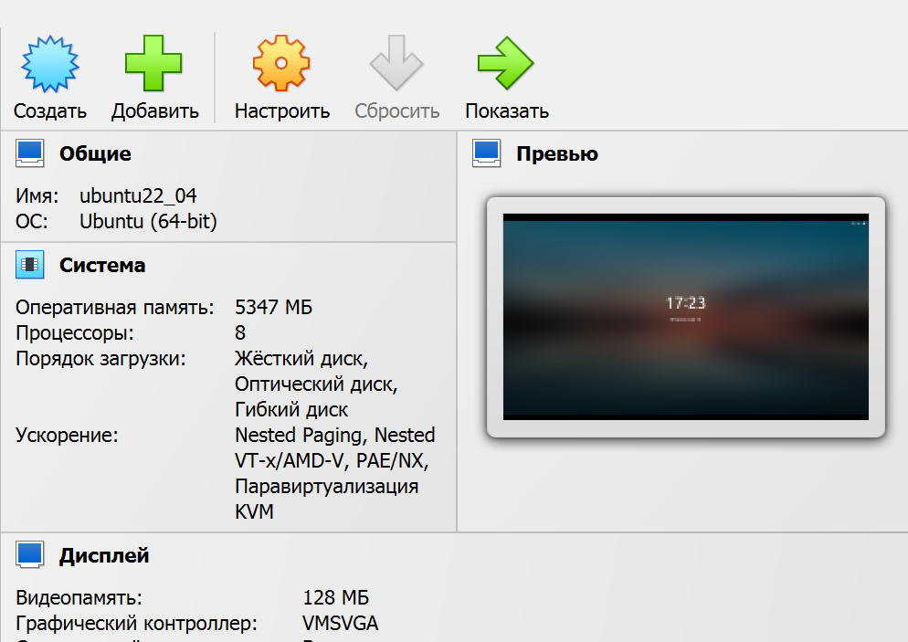

# homework-workdesk
Описание домашнего задания
1. Подготовка ПК для выполнения домашних работ.

---
- Этап 1: На основном ПК с ОС Windows 10  был установлен virtualbox, в котором создана ВМ на базе Linux (Ubuntu 22.04)
- 

- Этап 2: OC виртуальной машины подготовлена для работы, при необходимости программы будут доустановлены

